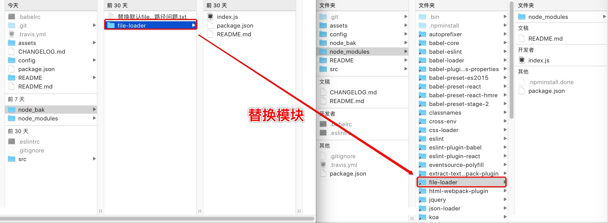
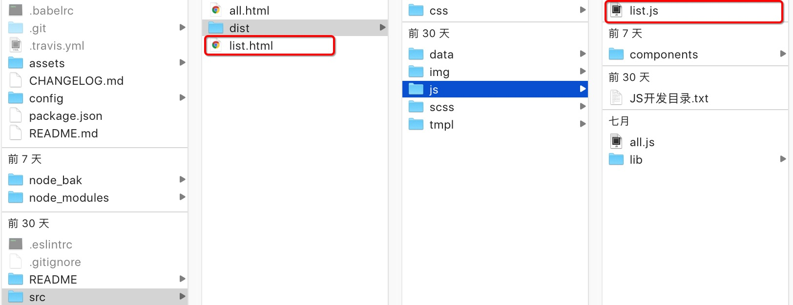

# Webpack+React集成环境框架

[](https://travis-ci.org/greengerong/qing)

一个完善的Koa+Webpack+React集成开发环境,实现了多页面应用入口,并附加很多实用组件

## 框架优点

- 支持多页面类型的React应用开发
- 实用Koa服务器进行构建,扩展性更强
- 分为开发环境(Dev)和上线(Prod)环境,可以自由选择并进行开发
- 支持React热加载,可以实现CSS及JS的热加载效果
- 附加Postcss工具,可实现Sass语法开发,自动填充CSS3兼容方案及CSS雪碧图的自动化构建
- 使用了CSS-Module技术,实现了样式的复用性和解决了样式污染**(在dist/css/common和dist/css/components中的样式不会启用CSS-Module**

##使用的技术

- [x] [Webpack](https://webpack.github.io)
- [x] [React](https://facebook.github.io/react/)
- [x] [Babel](https://babeljs.io/)
- [x] [Koa](https://github.com/koajs/koa)
- [x] [PostCSS](https://github.com/postcss/postcss)
- [x] [precss](https://github.com/jonathantneal/precss)
- [x] [CSS modules](https://github.com/outpunk/postcss-modules)
- [x] [autoprefixer](https://github.com/postcss/autoprefixer)
- [x] [webpack-dashboard](https://github.com/FormidableLabs/webpack-dashboard)

## 使用方法
**1.安装所需NodeJS模块**

进入你该项目文件夹,并在CMD/终端中执行命令安装Node依赖包,这里有一个需要注意的问题,由于webpack中file-loader的图片处理路径无法满足CSS背景图片的路径变化,需要将根目录下的node_bak中的file-loader文件夹替换node_modules中的file-loader文件夹
```
npm install
```


**2.创建入口及对应js文件**

在src开发目录中创建HMTL页面,并在src/dist/js中创建一个同名js即可



**3.开启热加载开发模式**

进入你该项目文件夹,并在CMD/终端中执行命令开启开发模式,这时候会显示一个控制台,能够看到项目对应的反馈信息及问题

```
npm start
```
**4.项目完成后进行打包压缩**

进入你该项目文件夹,并在CMD/终端中执行命令执行打包压缩,会在根目录生成一个assets的文件夹,文件夹内为压缩后的项目代码

```
npm run build 
```

## 其他框架特性内容介绍

**1.PostCss工具**

在框架中使用了PostCss的部分工具,主要为

- [Precss](https://jonathantneal.github.io/precss/) 可以实现类似sass语法功能,所以该框架支持类似Sass语法的编写,例如:
```css
/* before */

@for $i from 1 to 3 {
	.b-$i { width: $(i)px; }
}

/* after */

.b-1 {
	width: 1px
}
.b-2 {
	width: 2px
}
.b-3 {
	width: 3px
}
```
- [postcss-easysprites](https://github.com/glebmachine/postcss-easysprites) 可以实现图表的自动拼接,例如:


```css
/* before */

.arrowNext {
  background-image: url('dist/img/arrow-next.png#elements');
}
.arrowNext:hover {
  background-image: url('dist/img/arrow-next_hover.png#elements');
}
.arrowPrev {
  background-image: url('dist/img/arrow-prev.png#elements2');
}
.arrowPrev:hover {
  background-image: url('dist/img/arrow-prev_hover.png#elements2');
}

/* after */

.arrowNext { 
  background-image: url(dist/img/elements.png); 
  background-position: 0 0;
}
.arrowNext:hover { 
  background-image: url(dist/img/elements.png); 
  background-position: -28px 0;
}
.arrowPrev { 
  background-image: url(dist/img/elements2.png); 
  background-position: 0 0;
}
.arrowPrev:hover { 
  background-image: url(dist/img/elements2.png); 
  background-position: -28px 0;
}
```
## 更新记录

- [CHANGELOG](https://github.com/aemoe/webpack-react-framework/blob/master/CHANGELOG.md)

# License 

MIT

